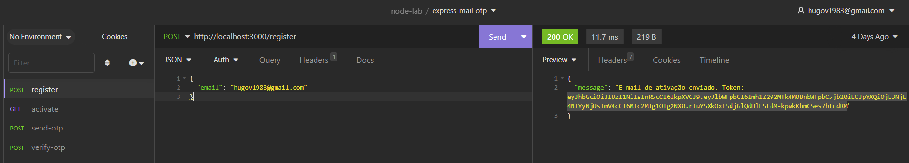
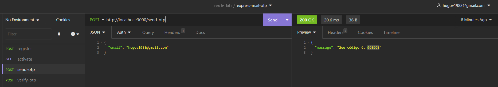
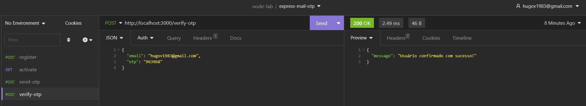

# Gerando código OTP e JWT via API

Esta aplicação consegue gerar código OTP e JWT para o processo de validação do usuário.

## Rotas

### Servers

Ambiente de desenvolvimento local: http://localhost:3000

### Validação com JWT

| Método | Path                    | Descrição                       |
| ------ | ----------------------- | ------------------------------- |
| POST   | /register               | Gera um código de validação JWT |
| GET    | /activate?token={token} | Válida um código JWT            |




### Validação com OTP

| Método | Path        | Descrição           |
| ------ | ----------- | ------------------- |
| POST   | /send-otp   | Gera um código OTP  |
| POST   | /verify-otp | Válida o código OTP |





## Executando o projeto

Executa a aplicação

```node
node app.js
```
